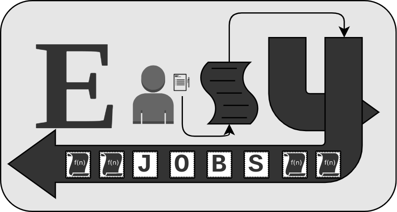

<h3> A jobs framework for managing and  distributing  async / non-async tasks </h3>

[](https://easyjobs.readthedocs.io/en/latest/?badge=latest) [](https://pypi.org/project/easyjobs/)


## Quick Start

```bash
$ virtualenv -p python3.7 easy-job-env

$ source easy-jobs-env/bin/activate

(easy-rpc-env)$ pip install easyjobs
```
#
<b>Documentation</b>: [easyjobs.readthedocs.io](https://easyjobs.readthedocs.io/)

#

## Usage - Jobs Manager
```python
import asyncio, os
from easyjobs.manager import EasyJobsManager
from fastapi import FastAPI

server = FastAPI()

os.environ['DB_PATH'] = '/mnt/jobs_database/'

@server.on_event('startup')
async def startup():

    job_manager = await EasyJobsManager.create(
        server,
        server_secret='abcd1234'
    )
```
```bash
$ uvicorn --host 0.0.0.0 --port 8220 job_manager:server
```
## Basic Usage - Worker

```python
import asyncio, os
from fastapi import FastAPI
from easyjobs.workers.worker import EasyJobsWorker

server = FastAPI()

@server.on_event('startup')
async def setup():
    worker = await EasyJobsWorker.create(
        server,
        server_secret='abcd1234',
        manager_host='0.0.0.0',
        manager_port=8220,
        manager_secret='abcd1234',
        jobs_queue='ETL',
        max_tasks_per_worker=5
    )

    every_minute = '* * * * *'
    default_args = {'args': ['http://stats']}

    async def get_data(url):
        return {'a': 1, 'b': 2, 'c': 3}
    async def load_db(data: dict):
        await db.tables['transformed'].insert(**data)
        return f"data {data} loaded to db"
    async def send_email(address: str, message: str):
        return f"email sent to {address}"

    @worker.task(run_after=['transform'], schedule=every_minute, default_args=default_args)
    async def extract(url: str):
        print(f"extract started")
        data = await get_data(url)
        return {'data': data}
    
    @worker.task(run_after=['load'])
    async def transform(data: dict):
        print(f"transform started")
        for k in data.copy():
            data[k] = int(data[k]) + 2
        return {'data': data}

    @worker.task(on_failure='failure_notify', run_after=['compute'])
    async def load(data):
        print(f"load started")
        await load_db(data)
        return {'data': data}

    @worker.task()
    async def failure_notify(job_failed):
        await send_email('admin@company.io', job_failed)
        return job_failed

    @worker.task()
    async def deploy_environment():
        print(f"deploy_environment - started")
        await asyncio.sleep(5)
        print(f"deploy_environment - completed")
        return f"deploy_environment - completed"

    @worker.task()
    async def prepare_db():
        print(f"prepare_db - started")
        await asyncio.sleep(5)
        print(f"prepare_db - completed")
        return f"deploy_environment - completed"

    @worker.task(run_before=['deploy_environment', 'prepare_db'])
    async def configure_environment():
        print(f"pre_compute - starting")
        await asyncio.sleep(5)
        print(f"pre_compute - finished")
        return f"pre_compute - finished"

    os.environ['WORKER_TASK_DIR'] = '/home/codemation/subprocesses'

    @worker.task(subprocess=True, run_before=['configure_environment'])
    async def compute(data: dict):
        pass
```
```python
#/home/codemation/subprocessescompute.py
import time
from easyjobs.workers.task import subprocess

@subprocess
def work(data: dict):
    print(f"starting heavy (blocking) computation on {data}")
    """
    insert work here
    """
    time.sleep(5) # Blocking
    return {'result': f'I slept for 5 seconds - blocking - with data', **data}
    
if __name__ == '__main__':
    work()

```

Start Worker - With 5 Workers

```Bash
$ uvicorn --host 0.0.0.0 --port 8221 job_worker:server --workers=5

extract started
transform started
load started
deploy_environment - started
prepare_db - started
deploy_environment - completed
prepare_db - completed
pre_compute - starting
pre_compute - finished
task subprocess called with ['/home/josh/Documents/python/easyjobs/compute.py', '0.0.0.0', '8220', 'abcd1234', '90226595-8779-11eb-a5cb-3bbcbb9b64eb', '{"args": [], "kwargs": {"data": {"a": 3, "b": 4, "c": 5}}}']
starting heavy computation on {'a': 3, 'b': 4, 'c': 5}
```
### Try it out"
    visit Job Manager uri: 
    http://0.0.0.0:8220/docs
<br>

